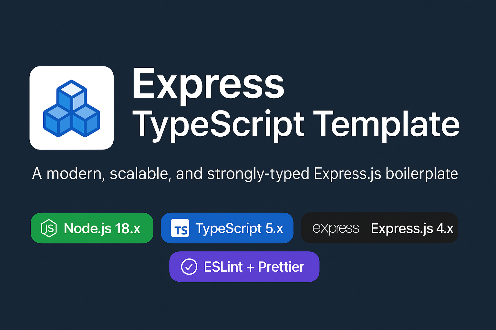

# Express TypeScript Template

A robust, scalable Express.js API template using TypeScript, Prisma, and modern best practices. Includes authentication, rate limiting, email/SMS providers, and ready-to-use API documentation.



## Installation

1. **Clone the repository:**

```powershell
git clone https://github.com/prav-raghu/express-typescript-template.git
cd express-typescript-template
```

2. **Install dependencies:**

```powershell
npm install
```

3. **Set up environment variables:**

- Copy `src/config/env.ts.example` to `.env` and update values as needed.

4. **Set up the database:**
    - Configure your database in `src/db/schema.prisma`.
    - Run migrations:

        ```powershell
        npx prisma migrate dev
        ```

    - (Optional) Seed the database:

        ```powershell
        npm run seed
        ```

## Usage

- **Start the server:**

    ```powershell
    npm run dev
    ```

- **Build for production:**

    ```powershell
    npm run build
    npm start
    ```

- **Run tests:**

    ```powershell
    npm test
    ```

- **API Documentation:**
  - Swagger docs available at `/docs` endpoint when running.

## Standards

- **TypeScript:** Strict typing and linting enforced.
- **Prisma:** Modern ORM for database management.
- **Jest:** Unit and integration testing.
- **ESLint & Prettier:** Code style and formatting.
- **RESTful API:** Follows REST conventions.
- **Security:** Includes rate limiting, input validation, and authentication middleware.
- **Modular Structure:** Organized by controllers, services, models, routes, and middlewares.

## Project Structure

```text
assets/           # Email templates
src/
  apis/           # External API integrations
  config/         # Environment and logger
  controllers/    # Route handlers
  db/             # Prisma schema and migrations
  docs/           # Swagger setup
  dtos/           # Data transfer objects
  middlewares/    # Express middlewares
  models/         # TypeScript models
  oauth/          # OAuth strategies
  providers/      # Email/SMS providers
  routes/         # API routes
  services/       # Business logic
  utils/          # Utility functions
  app.ts          # Express app setup
  server.ts       # Server entrypoint
```

## Future Items

- Add Docker support for production deployments
- Implement CI/CD pipeline (GitHub Actions)
- Add more OAuth providers (Twitter, LinkedIn)
- Enhance logging and monitoring
- Add GraphQL endpoint
- Improve test coverage and add e2e tests
- Integrate caching (Redis)
- Add API rate limiting per user

## Contributing

Pull requests and issues are welcome! Please follow the code standards and write tests for new features. Please note Github Co-pilot agent was used to do the boilterplate of this project

## License

MIT
